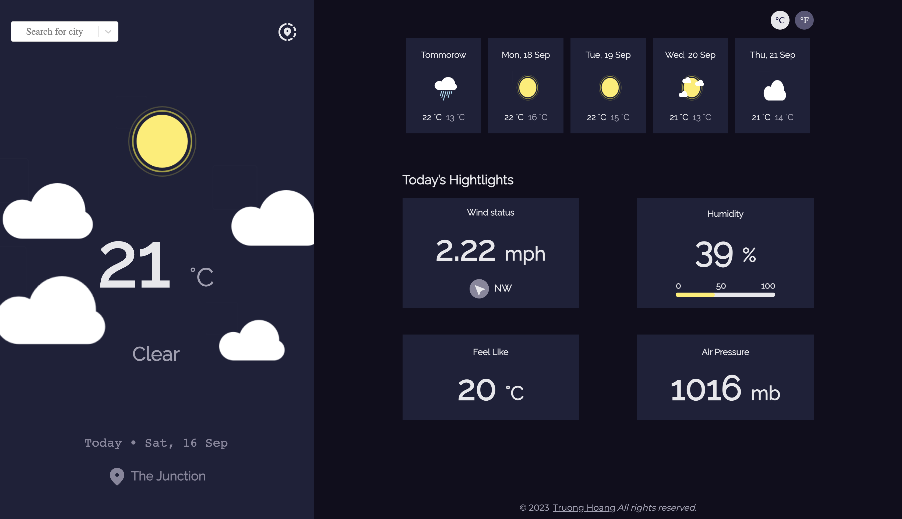

# WEATHER APP

***********************

**Project description** 

This weather app allows users to be able to see theit current weather and weather focast in a week of any places around the world.


## Table of Contents

- [Overview](#overview)
- [Built With](#built-with)
- [Features](#features)
- [How to use](#how-to-use)
- [Author](#author)
- [Acknowledgements](#acknowledgements)

<!-- OVERVIEW -->

## Overview

### Screenshots



### Links

[Live Site URL](https://clinquant-marshmallow-2752bd.netlify.app/)
[Solution URL](https://github.com/tin0312/weather-app)


- Experiences
- Take away

### Built With

- Javascript

- Semantic HTML5 markup

- CSS custom properties

- Flexbox

- React-select

- Moment.js

- [React](https://legacy.reactjs.org/docs/getting-started.html)

### What I learned

1. Working with API using Async/Await function.
2. Pulling data based on different locations.
3. Ability to do paranell API calls.
4. Debugging and refactoring code. 
5. Barrel import.
6. React Hooks to manipulate the virtual DOM.
7. Passing props between components in React.
8. Working towards the product requirements.   


## Features

- Display weather based on current location.
- Search for other cities weather
- See the the current weather & weather in the next 5 days.
- See the date and location of the weather.
- Image representation for each type weather.
- Maximum & minnimum degrees of each day.
- See wind status and wind direction.
- See the humidity percentage.
- See the the actual degree.
- See the air pressure number.
- Automatically locate current users and display weather
- Toogle between Celsius and Fahrenheit.
- Pin favourite locations
- Save favorite loctions in local storage. 
- Display weather for saved locations.

## How To Use

```bash
# Clone this repository
$ git clone git@github.com:tin0312/weather-app.git

# Install dependencies
$ npm install

# Run the app
$ npm run dev
```

## Acknowledgements

- Figma design is credited to [Figma Design](https://devchallenges.io/challenges/mM1UIenRhK808W8qmLWv) 

## Author

- Hoang Nhat Truong
- Website [your-website.com](https://{your-web-site-link})
- GitHub [@tin0312](https://github.com/tin0312)
- Twitter [@justin_hppp](https://twitter.com/justin_hppp)
